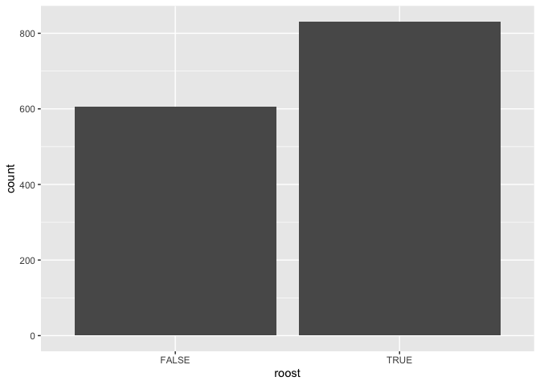
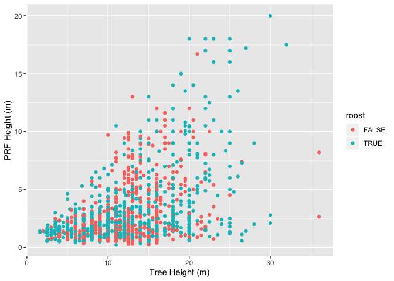
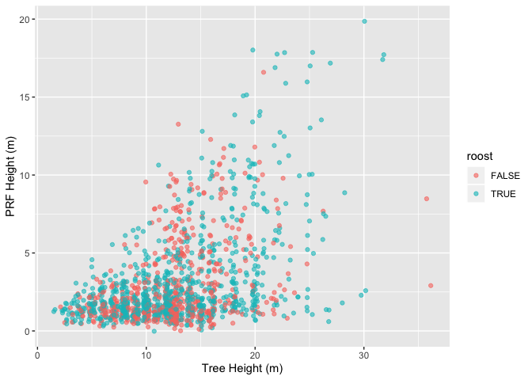
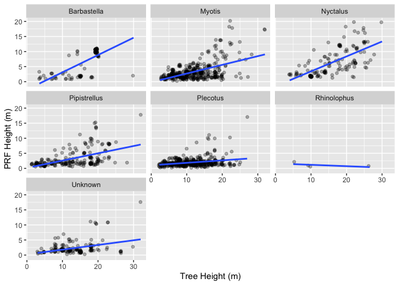
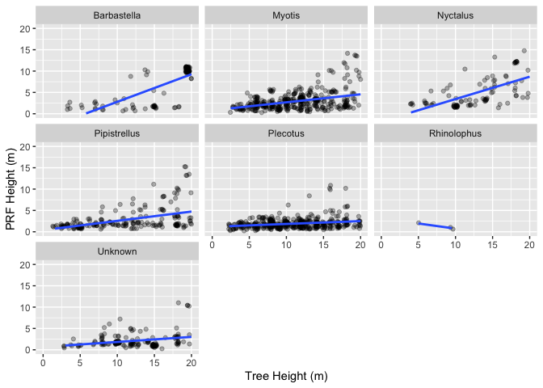

<!--html_preserve--><script>
  addClassKlippyTo("pre.r, pre.markdown");
  addKlippy('right', 'top', '#BEBEBE', '1', 'Copy code', 'Copied!');
</script><!--/html_preserve-->

<br/>

# Introduction
***
In this tutorial we're going to explore data from the [Bat Tree Habitat Key (BHTK) Database](https://drive.google.com/open?id=1Ebw8LNVZto2hYLlATRc25tGPepYRxxF5). More info on the BHTK project can be found [here](http://battreehabitatkey.co.uk/).

We'll be using the following packages:

 * The `tidyverse` for general data processing
 * The `lubridate` package for dates and times

If you don't have them installed use the `install.packages` function to install them: `install.packages("lubridate")`.
Load the packages:

```r
require(tidyverse)
require(lubridate)
```

<br/>

# The Data
***
The BTHK dataset includes an observation for every survey of a prf. As a result that dataset contains many duplicate values for each prf (due to repeat visits). In the first part of this tutorial we will be using a version of the data that I have processed to include only one observation per PRF. Where a roost has been found on any of the visits, this is coded in the `roost` variable as `TRUE`. For all other variables, the summary value is either the median, or the most common value (mode).

Read in the data with `read_csv()` and take a look at with the `glimpse()` function.

```r
# Read in the csv
features <- read_csv("data/processed/bthk data - unique features.csv")
# Preview the csv and check data types
glimpse(features)
```

```{style="max-height: 250px;"}
## Observations: 1,437
## Variables: 135
## $ feature_id                 <chr> "0009", "027Z", "03AB", "05WB", "069F…
## $ tree_ref                   <chr> "fw1", "hgg1", "d61", "wh8", "fl99", …
## $ prf_id                     <chr> "fw1 - bottom", "hgg1 - bottom", "d61…
## $ site_name                  <chr> "finemere wood", "hawker's grove", "d…
## $ county                     <chr> "buckinghamshire", "gloucestershire",…
## $ country                    <chr> "england", "england", "england", "eng…
## $ season                     <chr> "nursery", "pregnancy", "autumn flux"…
## $ species                    <chr> "quercus robur", "acer pseudoplatanus…
## $ alive_dead                 <chr> "alive", "alive", "alive", "alive", "…
## $ phase_1_habitat            <chr> "woodland / broadleaved / semi-natura…
## $ phase_1_code               <chr> "a1.1.1", "a.1.3.2", "a1.1.1", "a1.1.…
## $ stem_limb                  <chr> "stem", "stem", "stem", "stem", "stem…
## $ tree_height_m              <dbl> 16.0, 14.0, 12.0, 9.0, 9.0, 20.0, 13.…
## $ prf_height_m               <dbl> 4.87, 3.24, 0.84, 2.81, 0.89, 1.75, 1…
## $ prf_group                  <chr> "decay", "decay", "damage", "decay", …
## $ prf_type                   <chr> "woodpecker-hole", "wound", "frost-cr…
## $ enlarged                   <chr> NA, NA, NA, NA, NA, NA, NA, NA, NA, N…
## $ dbh_cm                     <dbl> 54.7, 32.9, 28.0, 18.7, 25.4, 145.6, …
## $ dph_cm                     <dbl> 51.4, 22.9, 25.9, 18.0, 27.8, 140.0, …
## $ entrance_height_cm         <dbl> 4.1, 272.0, 39.0, 9.0, 7.0, 12.0, 45.…
## $ entrance_width_cm          <dbl> 5.60, 11.50, 1.50, 5.50, 1.50, 5.00, …
## $ internal_height_cm         <dbl> 6.0, 38.0, 12.5, 100.0, 12.0, 29.0, 1…
## $ internal_depth_cm          <dbl> 6.9, 0.0, 10.0, 21.0, 0.0, 0.0, 0.0, …
## $ internal_width_cm          <dbl> 23.6, 11.0, 5.5, 11.0, 9.5, 27.0, 4.0…
## $ smooth                     <lgl> FALSE, FALSE, FALSE, TRUE, TRUE, FALS…
## $ bobbly                     <lgl> FALSE, FALSE, FALSE, FALSE, FALSE, FA…
## $ bumpy                      <lgl> TRUE, FALSE, FALSE, FALSE, TRUE, FALS…
## $ rough                      <lgl> FALSE, TRUE, TRUE, FALSE, FALSE, TRUE…
## $ clean                      <lgl> TRUE, TRUE, FALSE, TRUE, TRUE, TRUE, …
## $ waxy                       <lgl> TRUE, FALSE, FALSE, TRUE, TRUE, FALSE…
## $ stained_discoloured        <lgl> TRUE, FALSE, FALSE, TRUE, TRUE, FALSE…
## $ polished                   <lgl> TRUE, FALSE, FALSE, FALSE, FALSE, FAL…
## $ messy                      <lgl> FALSE, FALSE, TRUE, TRUE, FALSE, TRUE…
## $ dusty                      <lgl> FALSE, FALSE, FALSE, FALSE, FALSE, FA…
## $ debris                     <lgl> FALSE, FALSE, TRUE, FALSE, FALSE, FAL…
## $ sludgy_slimey              <lgl> FALSE, FALSE, FALSE, TRUE, FALSE, TRU…
## $ dry                        <lgl> TRUE, TRUE, TRUE, TRUE, TRUE, FALSE, …
## $ damp                       <lgl> FALSE, FALSE, TRUE, FALSE, FALSE, TRU…
## $ wet                        <lgl> FALSE, FALSE, FALSE, FALSE, FALSE, FA…
## $ dome                       <lgl> TRUE, FALSE, FALSE, FALSE, FALSE, TRU…
## $ spire                      <lgl> FALSE, FALSE, TRUE, TRUE, TRUE, FALSE…
## $ peak_wedge                 <lgl> FALSE, FALSE, FALSE, FALSE, TRUE, FAL…
## $ flat                       <lgl> FALSE, FALSE, FALSE, FALSE, TRUE, FAL…
## $ chambered                  <lgl> FALSE, FALSE, FALSE, FALSE, TRUE, FAL…
## $ tube                       <lgl> FALSE, TRUE, FALSE, FALSE, TRUE, FALS…
## $ competitors_visible___     <lgl> FALSE, TRUE, TRUE, FALSE, FALSE, TRUE…
## $ woodlice                   <lgl> FALSE, FALSE, TRUE, FALSE, FALSE, FAL…
## $ dusky_slug                 <lgl> FALSE, FALSE, TRUE, FALSE, FALSE, FAL…
## $ yellow_slug                <lgl> FALSE, FALSE, FALSE, FALSE, FALSE, FA…
## $ unidntified_other_sl__     <lgl> FALSE, FALSE, FALSE, FALSE, FALSE, TR…
## $ garden_snail               <lgl> FALSE, FALSE, FALSE, FALSE, FALSE, FA…
## $ lipped_snail               <lgl> FALSE, FALSE, FALSE, FALSE, FALSE, FA…
## $ unidentified_snail         <lgl> FALSE, FALSE, FALSE, FALSE, FALSE, FA…
## $ cave_spider                <lgl> FALSE, FALSE, FALSE, FALSE, FALSE, FA…
## $ harvestman                 <lgl> FALSE, FALSE, FALSE, FALSE, FALSE, FA…
## $ unidentified_spider        <lgl> FALSE, FALSE, FALSE, FALSE, FALSE, FA…
## $ spider_s_web               <lgl> FALSE, TRUE, FALSE, FALSE, FALSE, FAL…
## $ spider_egg_sac             <lgl> FALSE, FALSE, FALSE, FALSE, FALSE, FA…
## $ flies                      <lgl> FALSE, FALSE, FALSE, FALSE, FALSE, FA…
## $ harlequin_ladybird_s       <lgl> FALSE, FALSE, FALSE, FALSE, FALSE, FA…
## $ bat_fly_pupae              <lgl> FALSE, FALSE, FALSE, FALSE, FALSE, FA…
## $ wood_ants                  <lgl> FALSE, FALSE, FALSE, FALSE, FALSE, FA…
## $ unidentified_ants          <lgl> FALSE, FALSE, FALSE, FALSE, FALSE, FA…
## $ wasp_s                     <lgl> FALSE, FALSE, FALSE, FALSE, FALSE, FA…
## $ wasp_nest                  <lgl> FALSE, FALSE, FALSE, FALSE, FALSE, FA…
## $ hornet_s                   <lgl> FALSE, FALSE, FALSE, FALSE, FALSE, FA…
## $ hornets_nest               <lgl> FALSE, FALSE, FALSE, FALSE, FALSE, FA…
## $ honey_bees                 <lgl> FALSE, FALSE, FALSE, FALSE, FALSE, FA…
## $ tree_bumblebee_s           <lgl> FALSE, FALSE, FALSE, FALSE, FALSE, FA…
## $ unidentified_bee_s         <lgl> FALSE, FALSE, FALSE, FALSE, FALSE, FA…
## $ beetle_s                   <lgl> FALSE, FALSE, FALSE, FALSE, FALSE, FA…
## $ earwig_s                   <lgl> FALSE, FALSE, FALSE, FALSE, FALSE, FA…
## $ millipede_s                <lgl> FALSE, FALSE, FALSE, FALSE, FALSE, FA…
## $ centipede_s                <lgl> FALSE, FALSE, FALSE, FALSE, FALSE, FA…
## $ worm_s                     <lgl> FALSE, FALSE, FALSE, FALSE, FALSE, FA…
## $ butterfly_s                <lgl> FALSE, FALSE, FALSE, FALSE, FALSE, FA…
## $ moth_s                     <lgl> FALSE, FALSE, FALSE, FALSE, FALSE, FA…
## $ toad                       <lgl> FALSE, FALSE, FALSE, FALSE, FALSE, FA…
## $ blue_tit_s                 <lgl> FALSE, FALSE, FALSE, FALSE, FALSE, FA…
## $ great_tit_s                <lgl> FALSE, FALSE, FALSE, FALSE, FALSE, FA…
## $ wren_s                     <lgl> FALSE, FALSE, FALSE, FALSE, FALSE, FA…
## $ nuthatch_es                <lgl> FALSE, FALSE, FALSE, FALSE, FALSE, FA…
## $ nuthatch_mud               <lgl> FALSE, FALSE, FALSE, FALSE, FALSE, FA…
## $ jackdaw_s                  <lgl> FALSE, FALSE, FALSE, FALSE, FALSE, FA…
## $ green_woodpecker_s         <lgl> FALSE, FALSE, FALSE, FALSE, FALSE, FA…
## $ great_spotted_woodpe__     <lgl> FALSE, FALSE, FALSE, FALSE, FALSE, FA…
## $ barn_owl_s                 <lgl> FALSE, FALSE, FALSE, FALSE, FALSE, FA…
## $ bird_droppings             <lgl> FALSE, FALSE, FALSE, FALSE, FALSE, FA…
## $ bird_feathers_down         <lgl> FALSE, FALSE, FALSE, FALSE, FALSE, FA…
## $ bird_nest                  <lgl> FALSE, FALSE, FALSE, FALSE, FALSE, FA…
## $ grey_squirrel_s            <lgl> FALSE, FALSE, FALSE, FALSE, FALSE, FA…
## $ grey_squirrel_gnawin__     <lgl> FALSE, FALSE, FALSE, FALSE, FALSE, FA…
## $ grey_squirrel_nest         <lgl> FALSE, FALSE, FALSE, FALSE, FALSE, FA…
## $ dormouse_dormice           <lgl> FALSE, FALSE, FALSE, FALSE, FALSE, FA…
## $ dormouse_nest              <lgl> FALSE, FALSE, FALSE, FALSE, FALSE, FA…
## $ woodmouse_woodmice         <lgl> FALSE, FALSE, FALSE, FALSE, FALSE, FA…
## $ woodmouse_nest             <lgl> FALSE, FALSE, FALSE, FALSE, FALSE, FA…
## $ other_n_none_present__     <lgl> FALSE, FALSE, FALSE, FALSE, FALSE, FA…
## $ photo                      <lgl> TRUE, TRUE, TRUE, TRUE, FALSE, TRUE, …
## $ first_recorder             <chr> "matt dodds", "henry andrews", "henry…
## $ second_recorder            <chr> "henry andrews", NA, "louis pearson",…
## $ also_present               <chr> "steve allen, simon herbert, carla bo…
## $ comments                   <chr> "maternity colony", "none", "none", "…
## $ minimum_number_of_ba__     <chr> "> 10", NA, NA, NA, "1", NA, NA, "1",…
## $ approximate_distranc__     <dbl> 18.0, NA, NA, NA, 3.0, NA, NA, 50.0, …
## $ smell_description          <chr> "grass snake", NA, NA, "mushrooms", N…
## $ smell_none                 <lgl> FALSE, TRUE, TRUE, FALSE, TRUE, FALSE…
## $ smell_pleasant             <lgl> FALSE, FALSE, FALSE, TRUE, FALSE, TRU…
## $ smell_not_unpleasant       <lgl> FALSE, FALSE, FALSE, FALSE, FALSE, TR…
## $ smell_unpleasant_rep__     <lgl> TRUE, FALSE, FALSE, FALSE, FALSE, TRU…
## $ dna_result                 <chr> NA, NA, NA, NA, NA, NA, NA, NA, NA, N…
## $ identifier                 <chr> "NBNSYS0000005102", NA, NA, NA, "NHMS…
## $ common_name                <chr> "Brown Long-eared Bat", NA, NA, NA, "…
## $ latin_name                 <chr> "Plecotus auritus", NA, NA, NA, "Myot…
## $ genus                      <chr> "Plecotus", NA, NA, NA, "Myotis", NA,…
## $ family                     <chr> "Vespertilionidae", NA, NA, NA, "Vesp…
## $ alive                      <lgl> TRUE, TRUE, TRUE, TRUE, TRUE, TRUE, T…
## $ roost                      <lgl> TRUE, FALSE, FALSE, FALSE, TRUE, FALS…
## $ roost_confirmed_inspection <lgl> TRUE, FALSE, FALSE, FALSE, TRUE, FALS…
## $ date                       <lgl> NA, NA, NA, NA, NA, NA, NA, NA, NA, N…
## $ aspect_up                  <lgl> FALSE, FALSE, FALSE, FALSE, FALSE, FA…
## $ aspect_down                <lgl> FALSE, FALSE, FALSE, FALSE, FALSE, FA…
## $ north_aspect               <dbl> 1, 0, 1, 1, 0, 1, 0, 0, 1, 1, 1, 0, 1…
## $ east_aspect                <dbl> 0, 0, 0, 0, 1, 0, 0, 1, 0, 0, 0, 1, 0…
## $ south_aspect               <dbl> 0.0, 0.0, 0.0, 0.0, 0.0, 0.0, 1.0, 1.…
## $ west_aspect                <dbl> 0.0, 1.0, 0.0, 0.0, 0.0, 0.5, 1.0, 0.…
## $ tree_species               <chr> "quercus robur", "acer pseudoplatanus…
## $ tree_identifier            <chr> "NBNSYS0000003845", "NBNSYS0000003191…
## $ multiple_entrances         <lgl> TRUE, TRUE, FALSE, FALSE, FALSE, FALS…
## $ habitat_woodland           <lgl> TRUE, TRUE, TRUE, TRUE, TRUE, TRUE, T…
## $ habitat_linear             <lgl> FALSE, FALSE, FALSE, FALSE, FALSE, FA…
## $ habitat_open               <lgl> FALSE, FALSE, FALSE, FALSE, FALSE, FA…
## $ competitor_invertebrate    <lgl> FALSE, TRUE, TRUE, FALSE, FALSE, TRUE…
## $ competitor_large           <lgl> FALSE, FALSE, FALSE, FALSE, FALSE, FA…
## $ visit_count                <dbl> 1, 1, 1, 1, 4, 3, 3, 6, 2, 1, 1, 1, 1…
```
  
<br/>

## Roosts
***
Lets take a quick look at the most important variable in the dataset: `roost`. This variable tells us whether a roosting bat has been found in during any of the feature inspections.

Make a basic bar plot using ggplot to compare the number of roosts to non-roosts. 

* Pipe `%>%` the data into `ggplot()` and set the x aesthitic to `roost` (we only need one aesthetic for this plot),
* and add a geometry layer with `geom_bar()`. 

`geom_bar()` is going to do some of the work for us by counting the number of observations in each category. This is a useful way of visualising data where there is a limited number of outcomes (TRUE/FALSE, low/medium/high, etc.).

```r
features %>% 
  ggplot(aes(x = roost)) + 
  geom_bar()
```



Surveyors are more likely to collect and submit data if they find a bat roost. As a result it's probably the case that the proportion of roosts to non-roosts isn't representative of the real world. This is an important consideration when drawing conclusions from our analyis.
  
<br/>

# Roosting heights
***
The data contains information of the dimensions of trees and the potential roost features (prfs) they support. Two variables: the height of the tree `tree_height_m` and the height of the prf `prf_height_m` might yield some insight into the preferred roosting height of bats. As trees grow taller, they accumulate prfs throughout their limbs and trunk at all heights. If bats don't have any preference in roosting height, you would expect a positive relationship between tree height and prf height, as the average height of available prfs is assumed to increase with tree height. Any deviation from this may represent some ecological preference. 

There are a few of assumptions that we're making here: 

* prfs are equally likely to occur at any tree height; 
* prf characteristics are equally favourable at any height; and,
* bats in prfs are equally detectable and there is no detection bias in the data at any height.
  
<br/>

## Plotting the data
***
Let's make a basic scatter plot of the data to get a feel for it. We can then develop this plot to refine our understanding of the relationship.

* Pipe (`%>%`) the data into a call to ggplot and set the following aesthetics inside `aes()`:
 - map `tree_height_m` to the x axis
 - map `prf_height_m` to the y axis
 - map `roost` to the colour aesthetic so we can differentiate roosts and non-roosts
* Add a geometry layer of `geom_point()` - don't forget to use the `+` operator instead of the pipe to do this.
* Add some labels to the x and y axes with `xlab()` and `ylab()`


```r
features %>% 
  ggplot(aes(x = tree_height_m, 
             y = prf_height_m, 
             colour = roost)) +
  geom_point() +
  xlab("Tree Height (m)") + 
  ylab("PRF Height (m)") 
```

```
## Warning: Removed 19 rows containing missing values (geom_point).
```



The plot doesn't seem to indicate any clear trend in the data at the moment. It also looks like surveyers have a tendency to record round numbers for tree height and prf height - probably cause it is hard to estimate these values accurately in the field. This suggests that we have many points in the data plotted over each other, obscuring some of the information.

To address this we can do a couple of things. The first is to reduce the opacity of each point by setting a low `alpha` value. This will make the points more transparent, allowing us to see where the dense clusters are. Secondly, we can 'jitter' our points, using `geom_jitter()`. This will add some random noise to their vertical and horizontal positions, giving us a better idea of the clustering of points.

* Replace the call to `geom_point()` with `geom_jitter()`
* Inside `geom_jitter()` set the following attributes
  - set the `width` to 0.3
  - set the `height` to 0.3
  - set the `alpha` to 0.6 (60% opacity)


```r
features %>% 
  ggplot(aes(x = tree_height_m, 
             y = prf_height_m, 
             colour = roost)) +
  geom_jitter(alpha = 0.6,
              width = 0.3,
              height = 0.3
              ) +
  xlab("Tree Height (m)") + 
  ylab("PRF Height (m)") 
```

```
## Warning: Removed 19 rows containing missing values (geom_point).
```



Judging from the plot it is clear that there was a lot of overplotting. With jittering and a lower alpha value, it is easier to get an idea of the clustering of points.

The plot appears to indicate that bats will roost in the anywhere on the height of a tree, but as tree height increases, PRFs become less common in the top 20-30%. Furthermore, trees seem to be much less frequently recorded over about 20m - probably because they are less common above this height.

<br/>

# Comparing Bat Genera
***

We'll move on now to comparing the roost height preferences of different bat genera using a different version of the data. We'll read in the data containing an observation for each survey visit and filter the data for only roosts.

* Read in the data 

```r
surveys <- read_csv("data/processed/bthk data.csv")
```

<br/> 

## Filtering the data
***

* Filter the data for only inspections where a roost was confirmed and store it in a new object: `only_roosts`. 

The `filter()` function is usually passed a logical expression such as `species == "common pipistrelle"`. In this case the filter function would only keep the rows where the species variable is equal to (`==`) "common pipistrelle". Under the hood, this statement just evaluates to a vector of `TRUE` or `FALSE` values (a logical vector). This vector is what is actually used to keep/drop rows from the data. Because our vaiable `roost_confirmed_inspection` is already a logical vector, we only need to pass this to `filter()` to drop non-roosts.


```r
# Preview roost_confirmed_inspection:
head(surveys$roost_confirmed_inspection)
```

```
## [1]  TRUE  TRUE  TRUE FALSE  TRUE FALSE
```

```r
# Filter the data for only TRUE values in roost_confirmed_inspection
only_roosts <- 
  surveys %>% 
  # Keep only rows where roost_confirmed_inspection == TRUE
  filter(roost_confirmed_inspection)
```

<br/> 

## Fixing the missing genus entries
*** 

Before plotting, lets first have a look to see what genera are present in the data.

* Use the `unique()` function to return a vector of the unique values in the `genus` variable: `only_roosts$genus`


```r
unique(only_roosts$genus)
```

```
## [1] "Myotis"       "Plecotus"     "Nyctalus"     NA            
## [5] "Pipistrellus" "Barbastella"  "Rhinolophus"
```

Looks like there are some missing values in the `genus` variable. This is probably where a roost was recorded but the species was unknown. It makes sense to tidy this variable up so that it is clear in our plot. We can do this using the `mutate()`, `is.na()` and `if_else()` functions. 

`is.na(x)` returns a true value for every element of `x` that is missing:

```r
x <- c(NA, NA, NA)
is.na(x)
```

```
## [1] TRUE TRUE TRUE
```

`if_else()` takes three arguments:

* `condition`: a logical vector or a condition evaluating to TRUE or FALSE for each element.
* `true` the value to return where `condition` is TRUE
* `false` the value to return where `condition` is FALSE

Both true and false should be either the same length as condition or length 1. Check the [documentation](https://www.rdocumentation.org/packages/dplyr/versions/0.7.8/topics/if_else) for further info.

Simple example:

```r
x <- c(1:10)
if_else(condition = x > 5,
        true = "more than five",
        false = "less than or equal to five"
        )
```

```
##  [1] "less than or equal to five" "less than or equal to five"
##  [3] "less than or equal to five" "less than or equal to five"
##  [5] "less than or equal to five" "more than five"            
##  [7] "more than five"             "more than five"            
##  [9] "more than five"             "more than five"
```

Put it all together by:

* Using mutate to calculate a new variable:
 - Return `"Unknown"` where genus is `NA`
 - Return `genus` where it is not NA
* Assigning it to `genus` overwriting the original variable


```r
only_roosts <- 
  only_roosts %>% 
  mutate(genus = if_else(condition = is.na(genus),
                         true = "Unknown",
                         false = genus
                         ))
# Check it's worked:
unique(only_roosts$genus)
```

```
## [1] "Myotis"       "Plecotus"     "Nyctalus"     "Unknown"     
## [5] "Pipistrellus" "Barbastella"  "Rhinolophus"
```

<br/> 

## Plotting the data 
***

Now we can plot the data by genus. In the code below, I've made a couple of changes to the aesthetics, I've added a call to `geom_smooth()` (specifying a linear model as the method and no confidence intervals) and a call to `facet_wrap()` (specifying `genus` as the facet). 

* Remove the `colour` mapping of the roost variable
* Reduce the `alpha` to `0.3` inside `geom_jitter()`
* Add a call to `geom_smooth()` which will calculate and plot a linear model for each group
 - Specify `"lm"` (linear model) as the `method` 
 - Set `se` to `FALSE` to instruct it not to plot confidence intervals
* Add a call to `facet_wrap()` onto the end of the chain
 - supply the variable `genus` preceded by a tilda (`~`) to the `facets` argument: `~ genus`.


```r
only_roosts %>%
  # Remove the colour mapping of roost
  ggplot(aes(x = tree_height_m,
             y = prf_height_m)) +
  # Reduce alpha to 0.3
  geom_jitter(alpha = 0.3,
              width = 0.3,
              height = 0.3) +
  # Add a call to geom_smooth with a linear model and no conf intervals
  geom_smooth(method = "lm", se = FALSE) +
  xlab("Tree Height (m)") +
  ylab("PRF Height (m)") +
  # Add the facet_wrap call with genus as a facet
  facet_wrap(facets = ~ genus) 
```

```
## Warning: Removed 18 rows containing non-finite values (stat_smooth).
```

```
## Warning: Removed 18 rows containing missing values (geom_point).
```


We now have a plot of roost observations with a facet for each genus and linear model of PRF Height as a function of Tree Height (shown as a blue line). Flatter lines can be interpretted as a preference for lower roosting heights. Steep lines indicates that the genus does not have any strong preference.

<br/> 

## Conclusions
***

There does appear to be differing preferences for roosting height between bat genera.
From this we can interpret that most bats tend to prefer roosting in lower PRFs (generally below 10-15m). Plecotus bats appear to have a strong preference for PRFs below about 4m and Nyctalus seem happy to roost anywhere on the tree - maybe even favouring higher PRFs. 


<br/>

# Excercises
***
<br/> 

## Unique values {.tabset}
***

### Challenge
What is the 'tidy' way of writing this statement to return the same result?

```r
unique(only_roosts$genus)
```

```
## [1] "Myotis"       "Plecotus"     "Nyctalus"     "Unknown"     
## [5] "Pipistrellus" "Barbastella"  "Rhinolophus"
```
### Hints
You need to chain some statements together, first to extract the genus variable from only roosts, then to return the unique values.

* Use a combination of the pipe (`%>%`), `pull()` and `unique()`

### Answer
The answer results in slightly more code, but it is clearer in its intent.

```r
only_roosts %>% pull(genus) %>% unique()
```

```
## [1] "Myotis"       "Plecotus"     "Nyctalus"     "Unknown"     
## [5] "Pipistrellus" "Barbastella"  "Rhinolophus"
```

<br/> 

## Removing outliers {.tabset}
***

### Challenge
I think that some of the extreme values of Tree Height might be skewing our interpretation of the data. Filter out values above 20 m and create a plot with standardised axis scales of between 0 and 20m.

You should end up with the following plot:


### Hints

* Use the code from the final plot of the tutorial
* Use `filter()` to keep only values in `tree_height_m` that are less than or equal to (`<=`) 20
* Use the ggplot functions `xlim()` and `ylim()`
  - Pass both the minimum and maximum values of the axis

Read the docs if you're stuck - just google the function name and "R Documentation"

### Answer


```r
only_roosts %>%
  # Filter out the tree_height_m for values <= 20
  filter(tree_height_m <= 20) %>%
  # Remove the colour mapping of roost
  ggplot(aes(x = tree_height_m,
             y = prf_height_m)) +
  # Reduce alpha to 0.3
  geom_jitter(alpha = 0.3,
              width = 0.3,
              height = 0.3) +
  # Add a call to geom_smooth with a linear model and no conf intervals
  geom_smooth(method = "lm", se = FALSE) +
  xlab("Tree Height (m)") +
  ylab("PRF Height (m)") +
  # Add the facet_wrap call with genus as a facet
  facet_wrap(facets = ~ genus) +
  # Limit the x and y axes to values between 0 and 20
  xlim(0, 20) + 
  ylim(0, 20)
```

```
## Warning: Removed 12 rows containing non-finite values (stat_smooth).
```

```
## Warning: Removed 44 rows containing missing values (geom_point).
```

```
## Warning: Removed 11 rows containing missing values (geom_smooth).
```


