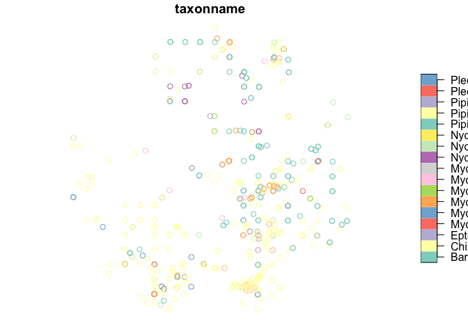

------------------------------------------------------------------------

Introduction
============

In this tutorial we’re going to explore some bat records from sheffield.
We’ll explore the use of a few packages for manipulating and visualising
spatial data. We’ll use the following packages which you’ll need to
install using `install.packages("package_name")`:

-   `tidyverse` for general data maniulation
-   `sf` for reading in and processing spatial data
-   `leaflet` and `leafem` for mapping spatial data

<!-- -->

    require(tidyverse)

    ## Warning: package 'tibble' was built under R version 3.6.2

    require(sf)
    require(leaflet)
    require(leafem)

------------------------------------------------------------------------

The Data
========

The dataset we’ll use has been sourced from the NBN Atlas. It is a
dataset of all records of bats within 10km of 53.378084, -1.5737915.

------------------------------------------------------------------------

Reading in spatial data
=======================

The first step is to read in the data I’ve downloaded from the NBN
Atlas. The data is stored as a shapefile (.shp) which is a common for
storing spatial data. The `sf` package supplies a function called
`st_read()` for importing spatial data. It can handle many formats of
spatial data including shaefiles. A lot is going on under the hood but
we can read data in as easily as passing it the file path as below.

    data <- st_read("data/raw/sheffield bat records.shp")

    ## Reading layer `sheffield bat records' from data source `/Users/matthew/Documents/Data Analysis/R Training/data/raw/sheffield bat records.shp' using driver `ESRI Shapefile'
    ## Simple feature collection with 926 features and 54 fields
    ## geometry type:  POINT
    ## dimension:      XY
    ## bbox:           xmin: -1.71651 ymin: 53.29353 xmax: -1.43734 ymax: 53.46448
    ## epsg (SRID):    4326
    ## proj4string:    +proj=longlat +datum=WGS84 +no_defs

### Preview the data

    glimpse(data)

    ## Rows: 926
    ## Columns: 55
    ## $ id         <fct> 2cfe30b4-dfd0-4f40-9630-52be85489d01, 1c1b6dd8-9ad5-476b-9…
    ## $ occrrncd   <fct> 4415405, 4035953, 4035910, 4037044, 225688885, 4037038, 11…
    ## $ license    <fct> CC-BY-NC, CC-BY-NC, CC-BY-NC, CC-BY-NC, CC-BY, CC-BY-NC, C…
    ## $ rghtshldr  <fct> The Mammal Society and Biological Records Centre, The Mamm…
    ## $ taxonname  <fct> Pipistrellus pipistrellus, Nyctalus noctula, Nyctalus noct…
    ## $ scntfcnmth <fct> "(Schreber, 1774)", "(Schreber, 1774)", "(Schreber, 1774)"…
    ## $ nmncltrlst <fct> sensu stricto, NA, NA, NA, NA, NA, sensu lato, sensu stric…
    ## $ commonname <fct> Common Pipistrelle, Noctule Bat, Noctule Bat, Pipistrelle …
    ## $ txncncptls <fct> NHMSYS0020001355, NHMSYS0000080186, NHMSYS0000080186, NBNS…
    ## $ rank       <fct> species, species, species, genus, species, genus, species …
    ## $ occrrncstt <fct> present, present, present, present, present, present, pres…
    ## $ occrrncdt  <fct> 2016-12-14, 1985-12-01, 1975-04-17, 1982-04-19, 1984-04-30…
    ## $ day        <fct> 14, 01, 17, 19, 30, 03, 23, 23, 07, 23, 20, 22, 03, 23, 01…
    ## $ month      <fct> 12, 12, 04, 04, 04, 04, 04, 04, 04, 04, 04, 04, 04, 04, 04…
    ## $ year       <fct> 2016, 1985, 1975, 1982, 1984, 1981, 2012, 1998, 2004, 1986…
    ## $ occrrncdtn <fct> NA, NA, NA, NA, 1984-04-30, NA, NA, NA, NA, 1986-04-23, NA…
    ## $ endday     <fct> NA, NA, NA, NA, 30, NA, NA, NA, NA, 23, NA, NA, NA, 23, 01…
    ## $ endmonth   <fct> NA, NA, NA, NA, 04, NA, NA, NA, NA, 04, NA, NA, NA, 04, 04…
    ## $ endyear    <fct> NA, NA, NA, NA, 1984, NA, NA, NA, NA, 1986, NA, NA, NA, 19…
    ## $ rwlclty    <fct> "Longshaw National Trust", "Little Matlock Wood & Acorn Hi…
    ## $ gridref    <fct> SK262805, SK3089, SK3487, SK3285, SK3189, SK3183, SK280865…
    ## $ crdntncrtn <fct> 100.0, 1000.0, 1000.0, 1000.0, 1000.0, 1000.0, 100.0, 1000…
    ## $ rawdepth   <fct> NA, NA, NA, NA, NA, NA, NA, NA, NA, NA, NA, NA, NA, NA, NA…
    ## $ collector  <fct> "Derek Whiteley", "Derek Whiteley", "Derek Whiteley", "Der…
    ## $ idntfdby   <fct> "Derek Whiteley", "Derek Whiteley", "Derek Whiteley", "Der…
    ## $ indvdlcnt  <fct> NA, NA, NA, NA, NA, NA, NA, NA, NA, NA, NA, NA, NA, NA, NA…
    ## $ orgnsmqntt <fct> NA, NA, NA, NA, NA, NA, NA, NA, NA, NA, NA, NA, NA, NA, NA…
    ## $ orgnsm_q31 <fct> NA, NA, NA, NA, NA, NA, NA, NA, NA, NA, NA, NA, NA, NA, NA…
    ## $ orgnsmscp  <fct> NA, NA, NA, NA, NA, NA, NA, NA, NA, NA, NA, NA, NA, NA, NA…
    ## $ orgnsmrmrk <fct> NA, NA, NA, NA, NA, NA, NA, NA, NA, NA, NA, NA, NA, NA, NA…
    ## $ rawsex     <fct> NA, NA, NA, NA, NA, NA, NA, NA, NA, NA, NA, NA, NA, NA, NA…
    ## $ lifestage  <fct> NA, NA, NA, NA, NA, NA, NA, NA, NA, NA, NA, NA, NA, NA, NA…
    ## $ occrrncrmr <fct> NA, NA, NA, NA, NA, NA, NA, NA, NA, NA, NA, NA, NA, NA, NA…
    ## $ idntfctnvr <fct> Accepted, Accepted - considered correct, Accepted - consid…
    ## $ bssfrcrd   <fct> HumanObservation, HumanObservation, HumanObservation, Huma…
    ## $ cllctncd   <fct> iRecord | Import, iRecord | Import, iRecord | Import, iRec…
    ## $ dtrsrc     <fct> "National Mammal Atlas Project, online recording", "Nation…
    ## $ dtrsrcd    <fct> dr671, dr671, dr671, dr671, dr743, dr671, dr2096, dr671, d…
    ## $ dtprvdr    <fct> The Mammal Society, The Mammal Society, The Mammal Society…
    ## $ dtprvdrd   <fct> dp8, dp8, dp8, dp8, dp77, dp8, dp239, dp8, dp8, dp77, dp8,…
    ## $ instttncd  <fct> NA, NA, NA, NA, Biological Records Centre, NA, NA, NA, NA,…
    ## $ kingdom    <fct> Animalia, Animalia, Animalia, Animalia, Animalia, Animalia…
    ## $ phylum     <fct> Chordata, Chordata, Chordata, Chordata, Chordata, Chordata…
    ## $ class      <fct> Mammalia, Mammalia, Mammalia, Mammalia, Mammalia, Mammalia…
    ## $ order      <fct> Chiroptera, Chiroptera, Chiroptera, Chiroptera, Chiroptera…
    ## $ family     <fct> Vespertilionidae, Vespertilionidae, Vespertilionidae, Vesp…
    ## $ genus      <fct> Pipistrellus, Nyctalus, Nyctalus, Pipistrellus, Nyctalus, …
    ## $ grdrf10000 <fct> SK, SK, SK, SK, SK, SK, SK, SK, SK, SK, SK, SK, SK, SK, SK…
    ## $ grd_rf_153 <fct> SK28, SK38, SK38, SK38, SK38, SK38, SK28, SK28, SK38, SK39…
    ## $ grdrf2000  <fct> SK28Q, SK38E, SK38N, SK38H, SK38E, SK38B, SK28Y, SK28Z, SK…
    ## $ grdrf1000  <fct> SK2680, SK3089, SK3487, SK3285, SK3189, SK3183, SK2886, SK…
    ## $ country    <fct> United Kingdom, United Kingdom, United Kingdom, United Kin…
    ## $ state      <fct> England, England, England, England, England, England, Engl…
    ## $ vitality   <fct> NA, NA, NA, NA, NA, NA, NA, NA, NA, NA, NA, NA, NA, NA, NA…
    ## $ geometry   <POINT [°]> POINT (-1.60739 53.32123), POINT (-1.54274 53.40145)…

`st_read()` has created a sptaial dataframe. This is essentially the
same as a normal dataframe but it as a column with each observations
geometry. One of the many benefits of this package is that we can use
all the dplyr functions such as `group_by()` and `summarise()` to
manipulate te data. Where you group records you can manipulate and
summarise their common geometries too.

Lets make a basic plot of the data. We’ll select just one variable
`taxonname` and plot the points usin `plot()`.

    data %>%
      select(taxonname) %>% plot()

That’s cool, but not really very useful. This is why we have leaflet!

------------------------------------------------------------------------

Leaflet - making basic maps
===========================

The best place to start with leaflet for R is by reading the
[documentation on github](https://rstudio.github.io/leaflet/). It works
in similar way to ggplot, where you initialise a map and add layers and
other features.

There are two basic components to a map: a base map and layers. The base
mapping is the underlying map which gives context to your layers. Comon
ones are Satellite Imagery and Ordinance Survey Mapping. Layers re what
you add on top to represent your data. They cold be points, polygons,
lines, heat maps, etc.

We’ll start out with a basic map using the following steps (all chained
together with the pipe - `%>%`):

1.  Initialise a map using the `leaflet()` function
2.  Add an os map base layer using the `addProviderTiles()` function
    (the `providers` object provides a list of available base maps)
3.  Store the map in the `my_map` object

<!-- -->

    my_map <- 
      leaflet() %>%
      addProviderTiles(provider = providers$OpenStreetMap) 

    my_map

<!--html_preserve-->

<!--/html_preserve-->

------------------------------------------------------------------------

Add some data
=============

Now we can add our data with the `addFeatures()` function which is from
the `leafem` package. This function takes a minimum of two arguments
`map` which we will supply using the pipe and `data` which we pass our
data of bat records.

This function is great because you can pass it any kind of sf object and
it will add it to the map.

    my_map %>%
      addFeatures(data)

<!--html_preserve-->

<!--/html_preserve-->

------------------------------------------------------------------------

Adding labels
=============

The map is pretty good but not very useful. We don’t know what species
of bat each point represents or when the records were made. To fix this
we can add a label using the `popup` argument.

Supply the name of one of the variables in our data preceeded by a tilda
sign (`~`) we can add some popup labels to the map.

I’ve done this with the `taxonname` which contains the most detailed
taxon level for each record. You can try it with any of the variables in
the data. Copy the code from above and add a popup argument to add some
labels.

Run the code and click on each point to see its taxon

    my_map %>%
      addFeatures(data, 
                  popup = ~ taxonname)

<!--html_preserve-->

<!--/html_preserve-->
More descriptive labels
-----------------------

Knowing the taxon name of each point is great, but what about when the
record was made or who recorded it?

The `popup` argument can only take one string per point to display. So
we have to find a way to combine each of these variables into one string
which we can pass to popup. There are two was of doing this: supply a
function and it’s arguments to the `popup` function to make our labels,
or make a new variable and pass the to `popup`. We’ll do the latter as
it is a bit easier.

To do this we’ll make use of the `mutate()` function from the `dplyr`
package to calculate a new variable in our spatial dataframe. [Check the
documentation on mutate for more information on it’s
use](https://www.rdocumentation.org/packages/dplyr/versions/0.5.0/topics/mutate).
We’re also going to use the paste function which concatenates strings
together into one string.

Basic use of `paste`:

    paste("Soprano Pipistrelle", "2020-07-01", "Matthew Whittle")

    ## [1] "Soprano Pipistrelle 2020-07-01 Matthew Whittle"

We can also add a seperator using the `sep` argument to seperate each
string passed to paste. This is inserted between each string:

    paste("Soprano Pipistrelle", "2020-07-01", "Matthew Whittle", sep = "////")

    ## [1] "Soprano Pipistrelle////2020-07-01////Matthew Whittle"

We’ll use the `taxonname`, `occrrncdt` and `collector` variables to make
an informative label for our map. Pass each one to the paste function
and it will paste them together for every observation. We’re going to
use the html tag for a line break ` ` as the seperator. This is
because our leaflet maps are actually just html, so we can use html tags
to format the popup labels.

    # Create the new variable
    data <- 
      data %>%
      mutate(label = paste(taxonname, occrrncdt, collector, sep = " "))

    # Check the result
    head(data$label)

    ## [1] "Pipistrellus pipistrellus 2016-12-14 Derek Whiteley"
    ## [2] "Nyctalus noctula 1985-12-01 Derek Whiteley"         
    ## [3] "Nyctalus noctula 1975-04-17 Derek Whiteley"         
    ## [4] "Pipistrellus 1982-04-19 Derek Whiteley"             
    ## [5] "Nyctalus leisleri 1984-04-30 Whiteley, D."          
    ## [6] "Pipistrellus 1981-04-03 Derek Whiteley"

That’s more informative. Now we can pass this new label to the `popup`
argument. Copy the code from above and change the popup argument.

    my_map %>%
      addFeatures(data, 
                  popup = ~ label)

<!--html_preserve-->

<!--/html_preserve-->

------------------------------------------------------------------------

More Layers
===========

We now have a more informative map but it would be useful to visualise
the distributions of different bat genera. We’ll do this by making a new
dataframe for each genus, adding them to the map and we’ll add some
functionality to conrol which genus we can see.

To do this we need to write some more code:

-   We’ll `filter()` our dataset for each of our selected genera
    creating a new spatial dataframe for each
-   Add a layer to the map for each new spatial dataframe using
    `addFeatures()`
-   Specify a group for each new layer using the `group` argument
-   Add a call to `addLayersControl()` att the end of our chain and pass
    a vector of our group names to the `overlayGroups` argument.

### Filter the data:

    pips <- data %>% filter(genus == "Pipistrellus")
    myotis <- data %>% filter(genus == "Myotis")
    nycs <- data  %>% filter(genus == "Nyctalus")

### Add the layers and layer control

To add multiple layers we need to chain a new call to`addFeatures()` for
each layer we want on the map. To control which layer we can see, we’ll
use the `addLayersControl()` function. To be able to control which layer
is visible, we need to assign a grop name to each layer. This is done
using the `group` argument within the call to `addFeatures()`. Pass a
descriptive but succinct name with each new layer. Then supply a vector
of the group names to the `overlayGroups` argument of
`addLayersControl()`. Be careful, the groups must be exactly the same
between the layers and layer control.

Run the code and then use the layer control in the top right of the map
to switch each layer on/off.

    my_map %>%
      # Add the layers - one call per layer
      addFeatures(pips, popup = ~ label, group = "Pipistrellus") %>%
      addFeatures(myotis, popup = ~ label, group = "Myotis") %>%
      addFeatures(nycs, popup = ~ label, group = "Nyctalus") %>%
      # Add the layers control with our vector of groups
      addLayersControl(overlayGroups = c("Pipistrellus", "Myotis", "Nyctalus"))

<!--html_preserve-->

<!--/html_preserve-->
Excersises
==========

Make a map of plecotus records
------------------------------

Create the following map of just Plecotus records and colour the points
in green.

### Output

<!--html_preserve-->

<!--/html_preserve-->
### Hints

-   Filter the data using `filter()` and make a new dataframe of the
    result
-   Initialise a new leaflet map using `leaflet()`
-   Add a basemap with `addProviderTiles()`
-   Add the Plecotus data as a layer using the `addFeatures()` function.
    -   Change the colour to green. Leaflet is written in US english so
        you need to use the `color` argument.
    -   You can supply any colour in english (“green”, “light blue”,
        etc.) or supply a html colour code.
-   Check the docs for [leaflet](https://rstudio.github.io/leaflet/) and
    [filter()](https://dplyr.tidyverse.org/reference/filter.html)

### Code Answer

    # Filter the data and make a new dataframe
    plecotus <- 
      data %>%
      filter(genus == "Plecotus")

    # Build up a leaflet map from scratch
    leaflet() %>% 
      # Add basemapping
      addProviderTiles(provider = providers$OpenStreetMap) %>% 
      # Add the data as a layer
      addFeatures(plecotus, 
                  color = "green")

<!--html_preserve-->

<!--/html_preserve-->
Change the base mapping
-----------------------

### Output

<!--html_preserve-->

<!--/html_preserve-->
### Hints

-   Make the map using the the `leaflet()`, `addProviderTiles()` and
    `addFeatures()` functions
-   Change the basemapping in the call to `addProviderTiles()`
    -   Satellite imagery is provided by Esri and is called World
        Imagery
    -   Inspect the `providers` object in the console to see what is
        available
    -   Select the name of the mapping using the `$` operator
-   Check the docs for [base mapping in
    leaflet](https://rstudio.github.io/leaflet/basemaps.html)

### Code Answer

    # build the leaflet map
    leaflet() %>% 
      # Change the basemapping to Esri.WorldImagery
      addProviderTiles(provider = providers$Esri.WorldImagery) %>% 
       # Add the data as a layer
      addFeatures(data)

<!--html_preserve-->

<!--/html_preserve-->
